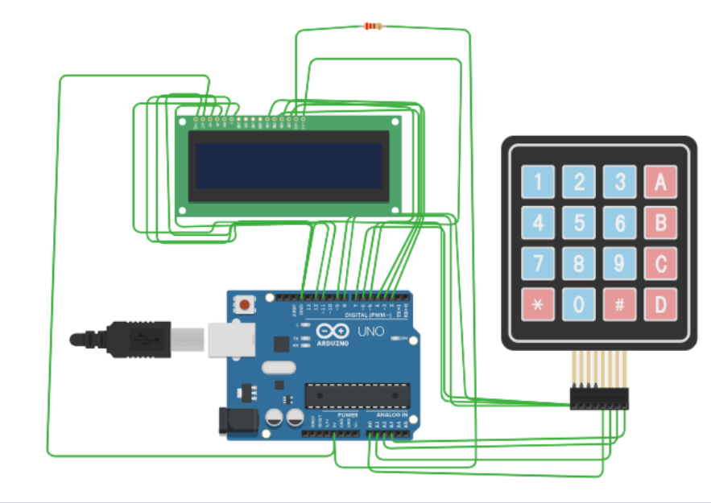

# CampoCafe – Arduino Smart Canteen Ordering and Billing System

## Overview
CampoCafe is an Arduino-based smart canteen ordering and billing system that allows users to select menu items using a 4x4 keypad and view the order details on a 16x2 LCD display. The system automatically calculates the total bill and asks the user to confirm the order.  

This project demonstrates basic embedded system concepts such as user input handling, display control, and menu-driven programming using Arduino.

---

## Features
- Menu display on LCD
- Food item selection using keypad
- Multiple item ordering
- Automatic bill calculation
- Order confirmation system
- Input support through both keypad and Serial Monitor
- Order reset option

---

## Components Used
- Arduino UNO
- 16x2 LCD Display
- 4x4 Matrix Keypad
- 220Ω Resistor (for LCD backlight)
- Jumper wires

---

## Menu Items

| Item | Price |
|-----|------|
| Tea | ₹10 |
| Coffee | ₹15 |
| Sandwich | ₹30 |
| Juice | ₹25 |

---

## Controls

```
1 → Tea
2 → Coffee
3 → Sandwich
4 → Juice

# → Generate Bill
* → Reset Order

A → Confirm Order
B → Cancel Order
```

---

## How the System Works

1. The system displays the canteen menu on the LCD screen.
2. The user selects menu items using the keypad.
3. Each selected item is added to the total bill.
4. Pressing **#** generates the final bill.
5. The system asks the user to confirm the order.
6. Press **A** to confirm or **B** to cancel the order.

---

## Tinkercad Simulation


You can view and run the circuit simulation here:

```
https://www.tinkercad.com/things/9ObYwYWrGea-campocafe-smart-canteen-system?sharecode=U8zPlCk_8sM5IkrtW1odMRph9P45HpGXh5vK6HKNzs0
```

---

## How to Run

1. Open the Tinkercad simulation link.
2. Start the simulation.
3. Use the keypad to select food items.
4. Press **#** to generate the bill.
5. Press **A** to confirm the order or **B** to cancel it.

---

## Technologies Used

- Arduino Programming (C/C++)
- Embedded Systems
- LCD Interfacing
- Matrix Keypad Interfacing

---


## Author
© Amogh S Y 2026
- Developed as an embedded systems project using Arduino and Tinkercad simulation.